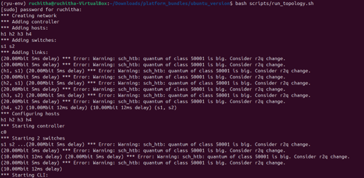

# SDN Mininet Based Simulation Project

## 📌 Problem Statement

This project implements a Software Defined Networking (SDN) solution using Mininet and a Ryu controller. The goal is to demonstrate controller–switch interaction, flow rule installation, and dynamic network behavior using OpenFlow.

---

## ⚙️ Technologies Used

* Mininet
* Ryu Controller
* OpenFlow 1.3
* Ubuntu (Virtual Machine)

---

## 🧠 Project Objectives

* Implement a learning switch using SDN controller
* Design and install flow rules (match–action)
* Demonstrate controller handling of packet_in events
* Implement flow timeout (idle + hard timeout)
* Observe network behavior dynamically

---

## 🏗️ Network Topology

* Hosts: h1, h2, h3, h4
* Switches: s1, s2
* Controller: Remote Ryu Controller

---

## ▶️ How to Run

### 1. Start Controller

```bash
bash scripts/run_controller.sh
```

### 2. Start Topology

```bash
bash scripts/run_topology.sh
```

### 3. Run Mininet Commands

```bash
h1 ping h2
h2 ping h3
```

---

## 🔬 Test Scenarios

### ✅ Scenario 1: Normal Forwarding

* Hosts communicate successfully
* Controller installs flow rules dynamically

### ✅ Scenario 2: Flow Timeout

* Idle timeout removes flow after 10 seconds
* Hard timeout removes flow after 40 seconds
* Flow is reinstalled when new packets arrive

---

## 📊 Observations

* Initial packets are flooded (unknown destination)
* Flow rules are installed after learning MAC addresses
* Flow entries expire based on timeout values
* Controller reinstalls rules after expiration

---

## 📸 Proof of Execution

### Topology Creation



### Ping Test


### Flow Table


### Idle Timeout


### Hard Timeout


---

## 📈 Performance Analysis

* Latency observed using ping
* Flow table updates monitored using ovs-ofctl
* Packet statistics analyzed from controller logs

---

## ✅ Conclusion

This project successfully demonstrates SDN concepts including dynamic flow rule management, controller-driven networking, and timeout-based flow handling.

---

## 📚 References

* Mininet Documentation
* Ryu SDN Framework
* OpenFlow Specification

